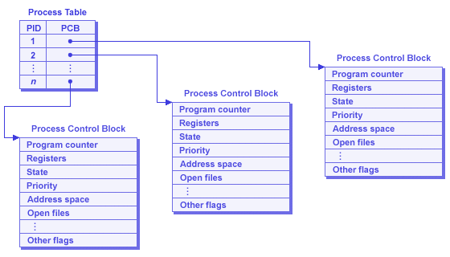

# JAVA interview based programs
## This repository contains interview based programs in java that are asked in the company exams and during the interview.
## Example code 1 ->
```
public class LearnCoding
{
  public static void main(String args[])
  {
    System.out.println("Hello World");
  }
}
```
### Explaining the example code 1
#### Here in the above program whatever written inside the main function gets executed first in it's respective order.
```
public static void main(String args[])
```
#### class : This Keyword is used to declare a ```class``` in Java
#### public : Here the ```public``` means that all the other methods or functions of ```LearnCoding``` class can access the ```main``` method.
#### void : Here ```void``` means that the ```main``` method should not return anything.
#### static : For any particular function of any particular class, if you want to use any method of any class we need to create objects. Whenever you create an object of a class it requires memory. If you declare something ```static``` you can invoke or revoke that method without using any objects. Hence it saves memory because we don't need to create any object here.
#### public static void main (psvm) : It;s the first function that is being executed in Java.
#### main : It represents the starting point of the program.
#### String[] args : It is used for command line argument. Here the name of the String array is args but it is not fixed and user can use any name in place of it.
#### System.out.println : It is used to print the content written inside the bracket inside double quotes in the terminal or a console and then move the cursor to the next line because here we have use ```println```.
## Now what happens if we change ```public static void main``` to ```public static int main```
```
public class LearnCoding
{
  public static int main(String args[])
  {
    System.out.println("Hello World");
  }
}
```
#### Here you will get an error - ```missing return statement``` because here you should be returning something as you have a function that should return an int value.
## What if Let's say we ```return 0```
#### Now the code looks like this ->
```
public class LearnCoding
{
  public static int main(String args[])
  {
    System.out.println("Hello World");
    return 0;
  }
}
```
#### But even after returning 0 we still get this error ```Main method must return a value of type void in class LearnCoding, please define the main method as : public static void main(String[] args)```.
#### So why is this happening?
#### The C and C++ programs which return int from the main function are processes of Operating System. The int value returned from the main in C and C++ is exit code or exit status. The exit code of C and C++ program illustrates, why the program terminated. Exit code 0 means successfull termination. However, non zero exit status indicates error. Example -> exit code 1 depicts Miscellaneous errors, such as "divide by zero".
#### Parent process of any child process keeps on waiting for the exit status of a child. And after recieving the exit status of child, cleans up the child process from the process table and frees the resources allocated to it. Which is why it becomes mandatory for C and C++ programs (which are processes of OS) to pass its exit status from main explicitly or implicitly.
#### process table of an OS looks something like this ->

